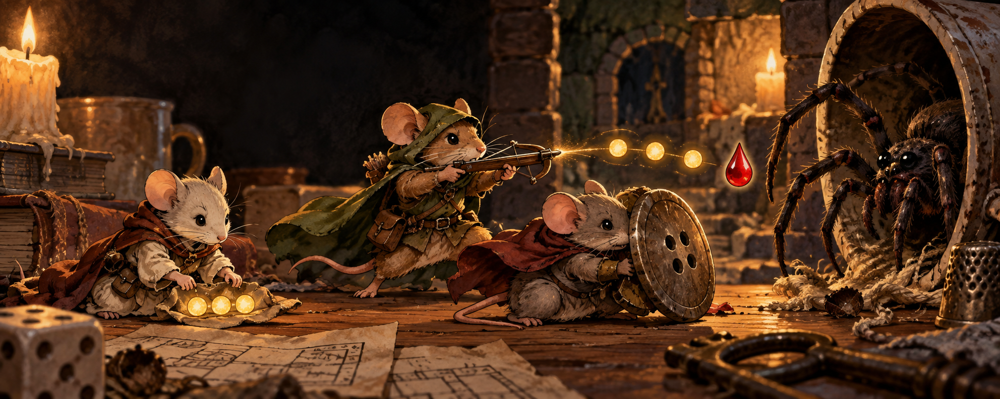

# Mausritter Damage Helper

<p align="center">
  <a href="https://github.com/ManuRomera/mausritter-damage-helper/releases/latest"></a>
  <a href="https://foundryvtt.com"></a>
  <a href="https://github.com/ManuRomera/mausritter-damage-helper/releases"></a>
  
  <a href="LICENSE"></a>
</p>



Automatización ligera para partidas de **Mausritter en Foundry Virtual Tabletop v13**. El módulo conserva la sencillez del sistema y elimina las operaciones repetitivas que suelen cortar el ritmo del combate.

## Qué hace

- Añade **Aplicar daño** a las tiradas de daño de Mausritter.
- Aplica automáticamente armadura, HP y FUE a todos los tokens seleccionados como objetivo.
- Detecta daño crítico, solicita la salvación de FUE y resuelve el resultado.
- Añade la condición **Herido** cuando corresponde.
- Integra opcionalmente GRIT y *Mausritter: We Deal in Pips*.
- **Nuevo:** al usar desde la ficha un arma, hechizo u objeto con puntos de uso, marca un uso automáticamente.
- Evita gastar dos veces el mismo uso aunque varios clientes vean el mensaje de chat.
- Reconoce también las tarjetas de Mausritter v13 que no incluyen el identificador interno del objeto.
- Avisa cuando se consume el último uso o el objeto ya está agotado.

En Mausritter los puntos rellenos representan usos gastados. Por eso el contador `0/3` pasa a `1/3` al utilizar el objeto y queda agotado al llegar a `3/3`.

## Compatibilidad

- Foundry Virtual Tabletop: **v13**.
- Sistema Mausritter: desde **0.3.3**, verificado con **0.6.1**.
- Idiomas: español e inglés.

El identificador interno continúa siendo `mausritter-combat-carousel` para que las partidas que usaban la versión 0.1.0 conserven sus ajustes.

## Instalación mediante manifest

En Foundry, abre **Add-on Modules → Install Module**, pega esta URL en **Manifest URL** y pulsa **Install**:

```text
https://github.com/ManuRomera/mausritter-damage-helper/releases/latest/download/module.json
```

Activa después **Mausritter Damage Helper** en la configuración de módulos de tu mundo.

## Uso

1. Usa un arma u objeto desde la ficha del personaje. Si tiene puntos de uso, el módulo marcará uno y lo indicará en el chat.
2. Para causar daño, selecciona como objetivo uno o varios tokens y pulsa **Aplicar daño** en la tarjeta de la tirada.
3. Ajusta las opciones desde **Ajustes del juego → Configurar ajustes → Ajustes del módulo**.

El gasto automático puede desactivarse con el ajuste **Gastar usos automáticamente**.

## Licencia y créditos

Código publicado bajo licencia MIT. Arte de portada original generado para este proyecto con OpenAI. Proyecto comunitario no oficial, sin afiliación con Losing Games ni Foundry Gaming LLC.

---

<p align="center">
  <a href="https://github.com/ManuRomera">
    <picture>
      <source media="(prefers-color-scheme: dark)" srcset="https://raw.githubusercontent.com/ManuRomera/ManuRomera/main/brand/MR_09_Monograma_Marfil_Transparente.png">
      
    </picture>
  </a><br>
  <sub>Hecho por <a href="https://github.com/ManuRomera"><b>Manu Romera</b></a> · Digital RPG Design</sub>
</p>
